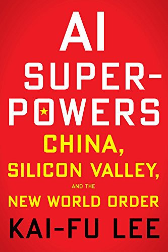

<h1 align = "center">Artificial Intelligence</h1>

<h2 align = "center"> Book Summary</h2> 

<h3 align = "center">Team member: Man Wu and Shuwen Wang</h3>

<h3 align = "center">
 <i> AI Superpowers by Kai Fu Lee</i>
</h3>

 

In Chapter 5 of AI Superpowers: China, Silicon Valley, and the New World Order, Lee illustrates the four waves of AI with the example of iFlyTek at the beginning. The four waves of AI which "will ultimately wash over us" are : internet AI, business AI, perception AI and autonomous AI.

<h1 align = "center"> Internet AI</h1>

The first wave of AI emerged more than a decade ago and became the mainstream in 2012. Generally speaking, Internet AI is the apply of AI algorithms as recommendation engines: these algorithms understand, study, and learn from our personal preferences, so as to recommend content specifically for us.

It is the data they obtain that drives these AI engines. At present, the largest database is in the hands of Internet giants. But these data must be labeled to really help the algorithm. The tags here do not mean to actively evaluate the content or add keywords to the content, but connect the data with pending behaviors, such as purchase and non-purchase, click and non-click, and so on. These "tags" are used to train the algorithm, and then the algorithm recommends content and products to users, so that we can consume more.

On the one hand, AI provides us with convenience; on the other hand, it can also learn and understand humans through data. The first wave of AI gave birth to a group of Internet companies driven by AI algorithms. In Chin, the leaders of these companies are today's headlines. Today’s Toutiao’s artificial intelligence engine searches for content on the Internet, uses natural language processing and computer vision technology, digests and organizes a large number of articles and videos from partners and contributors, and then based on the user’s past behaviors, such as clicking, reading, and browsing , Comments, etc., highly customized dynamic push for each user's interests, preferences and habits. Using artificial intelligence algorithms, Toutiao has achieved great success.

<h1 align = "center"> Business AI </h1>

The foundation of the first wave of AI is to label the browsing data of Internet users, while business AI is to label a large amount of professional data accumulated by traditional companies for decades, such as the identification of insurance fraud from claims accidents for insurance company, banks issue loans according to the record of payment and hospital keeps diagnostic records and patient survival rates, etc. Business AI digs out hidden connections that humans tend to ignore from these databases, refers to forgotten decisions and results, and uses labeled data to train algorithms, and ultimately makes it surpass the most experienced human practitioners.

The deep learning algorithm of Micro Loan in China not only looks at obvious indicators, such as how much money is in the user’s WeChat wallet, but also makes analysis based on data points that are considered insignificant by ordinary bank loan reviewers, such as the speed at which the user enters the date of birth, How much power is left in the phone battery and thousands of other data. These data seem to be very weakly correlated, but once the number is very large, it can greatly increase the accuracy of AI loan judgments, which is something humans cannot do.

 

Business AI is not only used in money-related fields, it can also be used in data-driven public services, such as medical diagnosis. It can help first-class doctors find the relevance of disease data, make better diagnoses, serve more patients, and relieve medical pressure. Business AI can also be used as court assistants, using past case data to provide judges with relevant evidence and advice on judgments, etc.

<h1 align = "center"> Perception AI</h1>

The third wave is to extend AI to our living environment, using a large number of sensors and smart devices to transform our real world into data that can be analyzed and optimized by deep learning algorithms. Lee named an integration of online and offline the "Online-Merge-Offline", or OMO for short, which brings the content perceived in the offline world to the online world.

In the future, perceptual AI will transform shopping malls, grocery stores, city streets and even our residences into OMO environments, and then produce some AI applications that make users truly feel futuristic. In addition to shopping, OMO can also drive education. It can be used in classroom exercises, homework and exercises, exams and grading, and tailor-made tutoring. This can not only reduce the burden on teachers and allow them more time to care about other aspects of students; it can also help students learn, especially students with poor grades. The artificial intelligence system can provide detailed classroom information which allows parents and students to use these Information to choose the corresponding counseling service.

<h1 align = "center"> Autonomous AI</h1>

Autonomous AI is the culmination of the first three waves of AI, combining extremely complex data with machine perception to produce machines that can not only understand the world, but also change it. Autonomous AI devices could revolutionize the daily lives of most of us, including shopping malls, restaurants, cities, factories, fire departments, and more.

In the case of drones, for example, swarms of autonomous drones can work together to paint the exterior walls of houses in a matter of hours. Heat-resistant drones can also be used to put out forest fires, search and rescue after hurricanes and earthquakes, and deliver food and water to stranded people.

In autonomous driving, there are now dozens of companies racing to commercialize the technology and replace human drivers with autonomous vehicles. Autonomous cars must be trained with millions or even billions of kilometres of driving data to learn to recognise objects and predict the movements of vehicles and pedestrians. There are two frontrunners -- Google and Tesla.

Google is the first company to develop autonomous driving technology, striving to create the perfect product, after autonomous driving is far safer than human driving, then leap directly into full autonomy of artificial intelligence. Elon Musk's Tesla, on the other hand, takes an incremental approach, adding some features to its cars as soon as they are developed. There are, of course, big risks.

China also has its own Tesla model, but unlike the US, the key to China's incremental adoption model is building new infrastructure to accommodate self-driving cars. The country is adjusting existing roads, changing the shape of trucks and even building new cities that can accommodate self-driving cars. The active actions of the government have turned the application into the co-evolution of cities and artificial intelligence.

As for who will take the lead in the four waves of AI, the author gives his opinion that the two countries will be roughly evenly divided. The following chart shows the author's prediction.

 

 Conclusion</h1>

We need to understand AI, make good use of AI, and be prepared to meet the challenges posed by AI. "If data is the new oil, China is the new Saudi Arabia." Data is essential to AI, but how can we strike a balance between personal privacy and public data? This may depend on the choice of each country. The protection of user privacy in the United States can be seen from Facebook's "Cambridge Analytica" incident and a series of hearings afterwards. In China, there is law which was introduced in 2017, also stipulates that illegal collection and trading of user data should be punished. But overall, the current Chinese users' rejection of collecting personal data in public places is not yet strong, which will bring a great initial advantage in the implementation of perceptual AI.

